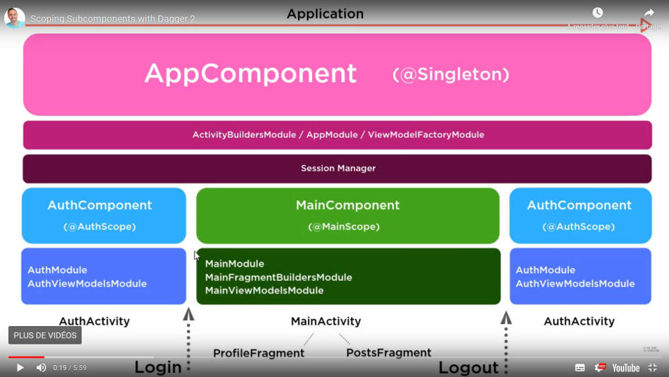

# Dagger2Course

Here's a list of the concepts I saw in the course :
 •	Dagger version 2.2+ (Focus on Dagger-Android)
 •	Dagger basics: 
 1.	DaggerApplication
 2.	DaggerAppCompatActivity 
 3.	DaggerFragment
 •	@Provides, @Binds, @BindsInstance explanation
 •	Map Multibinding
 •	Subcomponents
 •	Scopes
 •	Custom Scopes
 •	@ContributesAndroidInjector
 •	Activity Injection
 •	Fragment Injection
 •	ViewModel Injection
 •	Retrofit2 and Dagger
 •	Proper MVVM Architecture (Model View View-Model)
 •	An intro to the new Jetpack Navigation Component library
 •	And much more...

Here is a diagramm of the Dagger Architecture of our App : 
 
  

